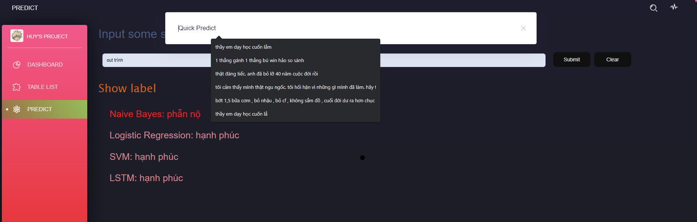
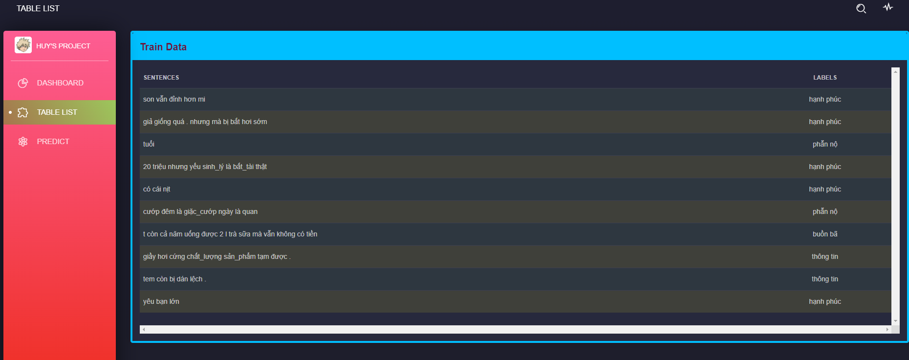
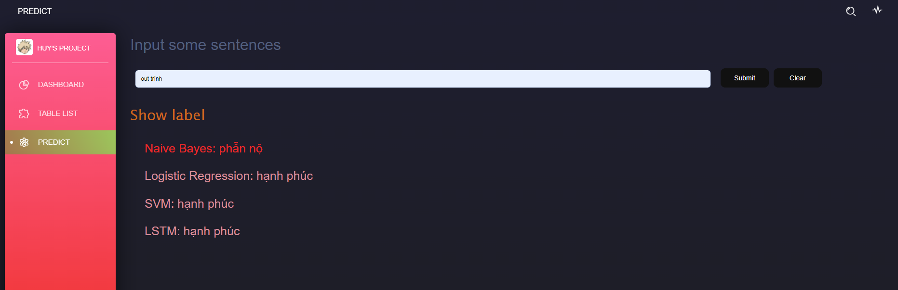

# Angular app for machine learning
This template I use is from Creative Tim. Visit [Tim's Shop](https://www.creative-tim.com/)

## Commands
```
1. npm install // install all the dependencies
2. npm start // run the application
```

## What does this app do?

### Show some information of the machine learning data
The data I sent to angular server is from flask api. To get the code of this api, visit site [vietnamese-comment-sentiment-analysis](https://github.com/HuyTranTuan/vietnamese-comment-sentiment-analysis).

### Sentiment Analysis
Angular server send a query with the following parameters(this is the string that you type in) and receive the results flask application gets from pre-trained models

## Some photos about this application
1. First site<br/>


2. Table<br/>


3. Predict<br/>


4. Quick predict from everywhere<br/>

